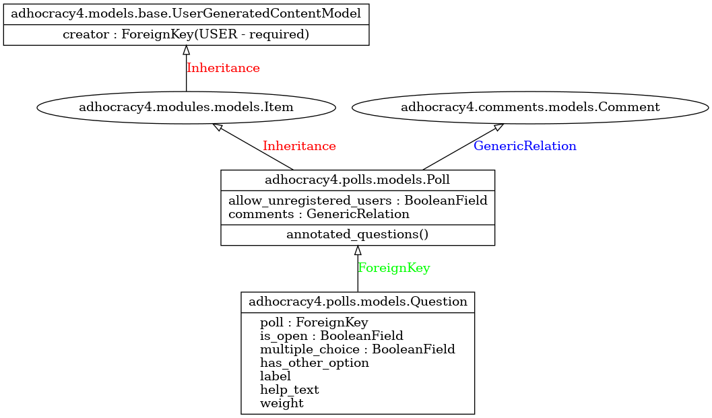

# Modules inheritance

Most of a+ participation modules (Idea, Interactive Events, Debate, Documents, Polls, Topics) are inhereted from adhocracy4 [Item model](https://github.com/liqd/adhocracy4/blob/main/adhocracy4/modules/models.py#L418) and the [Moderateable model](https://github.com/liqd/adhocracy-plus/blob/main/apps/moderatorfeedback/models.py#L31).

## Poll module -- aka Survey

For the UI interaction see the [wiki diagram](https://wiki.liqd.net/_detail/aplus_poll.png)

## Idea module

For the UI interaction see the [wiki diagram](https://wiki.liqd.net/_detail/aplus_ideachallenge.png)
And the Map Idea module inherits from the AbstractIdea and adds a point field, see the [wiki diagram](https://wiki.liqd.net/_detail/aplus_brainstorming_map.png)

## Topic module

There are two types of topics:  
- Debates: For the UI interaction see the [wiki diagram](https://wiki.liqd.net/_detail/aplus_debate.png)  
- Prioritization: For the UI interaction see the [wiki diagram](https://wiki.liqd.net/_detail/aplus_prioritization.png)

## Text Discussion module

For the UI interaction see the [wiki diagram](https://wiki.liqd.net/_detail/aplus_textreview.png)

## Interactive Event module

For the UI interaction see the [wiki diagram](https://wiki.liqd.net/_detail/aplus_interactiveevent.png)

## Proposal module -- aka Budgeting

For the UI interaction see the [wiki diagram](https://wiki.liqd.net/_detail/aplus_participatorybudgeting.png)

## Debate module

