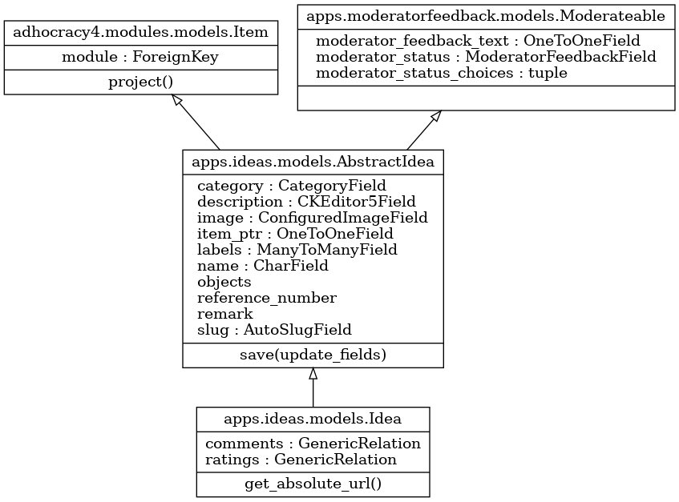
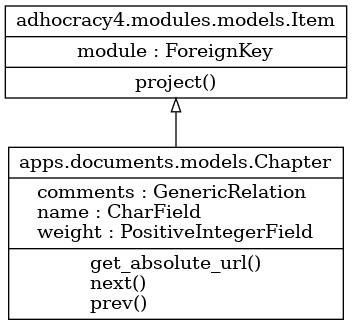
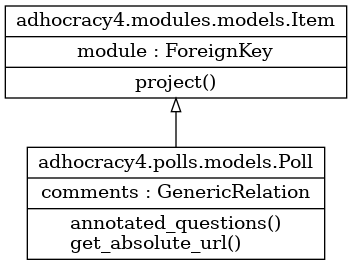
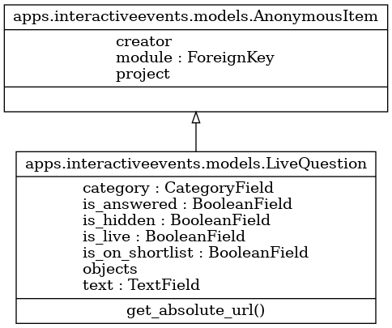
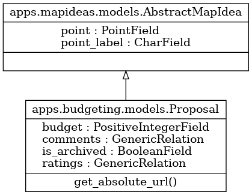
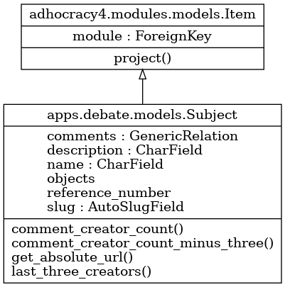

# Modules inheritance

Most of a+ participation modules (Idea, Interactive Events, Debate, Documents, Polls, Topics) are inhereted from adhocracy4 [Item model](https://github.com/liqd/adhocracy4/blob/main/adhocracy4/modules/models.py#L418) and the [Moderateable model](https://github.com/liqd/adhocracy-plus/blob/main/apps/moderatorfeedback/models.py#L31).

## Idea module

## Topic module

## Text Discussion module

## Survey module

## Interactive Event module

## Budgeting module

## Debate module

