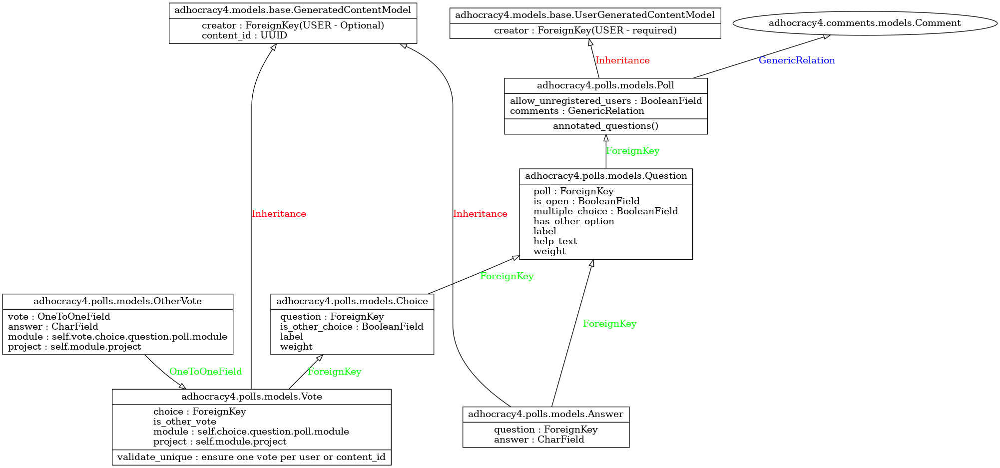

# Poll
The poll module (aka Survey) can be attached as a participation type in the project's dashboard. A poll has Questions that users can interact either by giving an Answer in text format, or by voting on Choices. A Vote can also receive another vote and an answer. Therefore the way answers and votes are related to the Poll, is through the Question table. Votes particularly are first related to a choice, which choice is related to a question.

**enlarge the image with right-click**

# Open Poll

It is an enhancement of the existing a4 Poll module, which was accessible only to registered users.  
The open poll allows access to unregister users by a checkbox in the project's dashboard poll module. For this enhanced feature, we decoupled the creator from the poll's answers and votes. The new class `GeneratedContentModel` - see file [adhocracy4/models/base.py](https://github.com/liqd/adhocracy4/blob/main/adhocracy4/models/base.py) has the creator relation as optional, and introduces the new field `content_id` to provide a unique ID for filtering the answers and votes of a non registered user, because there is no creator. 

Answers and Votes classes used to inherit from the `UserGeneratedContentModel` and have been updated to inherit now from the new `GeneratedContentModel`, so they may either have a creator or a content_id field. Answer has also a constrain (unique together) in the combination of `Question`, `Creator`, `Content_id` depending on whether a creator or content_id field exists.

Permissions `allows_unregistered_users` are now also in place for enabling those unregistered users to interact with the open poll - see the file [adhocracy4/polls/predicates.py](https://github.com/liqd/adhocracy4/blob/main/adhocracy4/polls/predicates.py).

For submitting the open poll, we provide a checkbox labelled with `agreed_terms_of_use` which is equivalent to agreement of the project's terms users have to accept upon signing-up. The terms agreement checheckbox is placed at the end of the poll, along with a [captcha written in React](https://github.com/liqd/adhocracy4/blob/main/adhocracy4/static/Captcha.jsx) to filter out robots and spam. Both fields need to filled in by the user in order to be able to submit the poll form.

The open poll is intended for public projects only. Private and semi-private projects require a user account to interact with by design, thus the `allow_unregistered_users` option in the poll module dashboard has no effect for these type of projects. 

Project insights do count unregistered users, and exporting a poll as an excel also counts votes and answers from unregistered users with the prefix 'ANON'.
